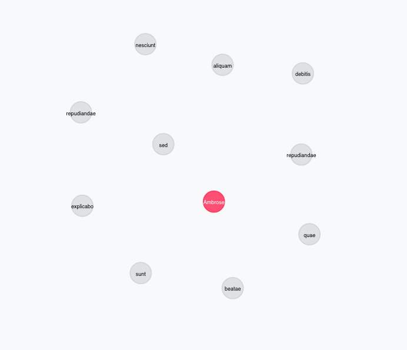

= Découverte de Neo4j
Christophe Willemsen <chris@neoxygen.io>
v1.0, 14-01-2015
:toc:
:homepage: http://chris.neoxygen.io

link:../index.html[Retour à l'accueil du site]

== Introduction

Les bases de données graphe sont maintenant au coeur des piles technologiques utilisées par les entreprises traitant des données hautement connectées.

Les graphes business, graphes sociaux, graphes de connaissances, graphes d'intérêts et graphes de médias sont des termes quotidiennement retrouvés dans les nouvelles technologiques.

Et ceci pour une bonne raison. Le modèle graphe vous offre une manière flexible de traiter les relations qui existent dans vos données. Et les bases de données graphes vous offrent une solution rapide et efficace pour stocker, retrouver et interroger ces données.

http://neo4j.org[Neo4j], la base de données graphe la plus populaire, a prouvé son abilité à traiter de larges quantitiés de données ultra-connectées dans beaucoup de cas d'usage. Durant la dernière édition du http://graphconnect.com/[GraphConnect], des compagnies comme TomTom et Ebay's Shutlle ont démontré le gain que leur apportait l'adoption de Neo4j afin d'offrir une expérience utilisateur unique à leurs clients ou editer des mappings de cartographie.

Neo4j est développé et supporté par *Neo Technology*, une startup qui est devenue une société respectée dans le monde des bases de données.

== Qu'est-ce qu'un graphe ?

Un graphe est une structure de données générique, composée de noeuds (entités) reliées par des relations. Dans le modèle de graphe à propriétés, chaque noeud et relation peut être libellée et contenir plusieurs propriétés les décrivant.

image::../_images/graphe.png[Un graphe]

== Qu'est-ce qu'une base de données graphe ?

Une base de données graphe est une base de données optimisée pour les opérations sur les données connectées.

Les bases de données graphe fournissent une performance de haut niveau pour des opérations en ligne en utilisant des structures de stockage dédiées aux noeuds et relations. Elles ne doivent pas calculer les relations (JOINTURES) au moment de la requête mais les enregistrent efficacement comme part entière de votre donnée.

Prenons un cas d'usage classique, où des utilisateurs suivent d'autres utilisateurs.

Un utilisateur sera représentée par un *noeud* et peut avoir un libellé et des propriétés. Les libellés peuvent servir à définir les différents rôles de vos noeuds.

Le lien entre ces deux utilisateurs sera représenté par une *Relation*, qui peut également avoir des propriétés et un *type* représentant la nature de cette relation. Les relations ajoutent une signification sémantique à vos données.

En analysant le graphe, nous pouvons nous rendre compte qu'il est naturel de représenter nos données dans un graphe et de l'enregistrer dans une base de données graphe.

== Cypher, le langage de requêtes Neo4j

Requêter un graphe peut sembler difficile au premier abord. Afin de simplifier ce processus, Neo4j a développé Cypher, un langage de requêtes déclaratif orienté graphes, optimisé pour la lisibilité and la facilité d'expression humaine pour les développeurs, administrateurs et les experts de domaines.

Etant déclaratif, Cypher se tourne sur l'expression de demander *que* retrouver dans le graphe et non *comment* le retrouver.

Le langage se compose de plusieurs clauses distinctes. Vous pouvez en apprendre d'avantage dans le http://neo4j.com/docs/stable/[manuel Neo4j].

Voici une liste non-exhaustive des clauses quotidiennement utilisées pour lire et mettre à jour le graphe :

[horizontal]
MATCH:: Trouve un "exemple" de motif que vous définissez dans le graphe.
WHERE:: Filtre les résultats avec des prédicats, comme en SQL. Il y a beaucoup de prédicats en Cypher cependants, incluant les opérations de collection et les *MATCH* de graphes.
RETURN:: Retourne un résultat de requête sous la forme demandée, valeurs scalaires, éléments de graph, chemins, collections ou même documents.
CREATE:: Crée des éléments de graphe (noeuds ou relations) avec les libellés et propriétés.
MERGE:: Trouve ou crée des motifs. C'est une combinaison de MATCH et CREATE.

Cypher est avant-tout orienté motifs, signifiant que vous décrivez une représentation visuelle que vous avez déjà vues en texte (ASCii-art). Il utilise les parenthèses pour définir les noeuds (comme *(u:User)*) et des flèches (comme *-->* ou *-[:SUIT]->* ) pour les relations.

En regardant le dernier graphes des utilisateurs, une requête demandant de retrouver Hannah Hilpert et les utilisateurs la suivant peut être écrite de la façon suivante :

[source,cypher]
----
MATCH (user:User {name:'Hannah Hilpert'})<-[:FOLLOWS]-(follower) 
RETURN user, follower
----

== Quelques notions de Franglais

La communauté Neo4j est magnifique, composée de personnes vraiment très compétentes et super sympathiques. Beaucoup de ressources sont disponibles sur Internet mais peu malheureusement sont en Français.

L'initiative de la traduction du manuel, dont je suis à l'origine, a pour l'instant été stoppée jusqu'à ce qu'un processus de traduction efficace soit mis en place.

Afin donc de ne pas vous perdre sur la toile, voici quelques notions Français => Anglais qui pourront vous être utiles afin de trouver des informations sur le net.

[horizontal]
Noeud:: *Node* Représentant une entité dans votre graphe
Libellé:: *Label* Permet de grouper les noeuds par utilisation, par exemple les labels User, Person, Category, Color, ...
Type:: *Type* de la relation, permet d'ajouter un sens à vos relations, par exemple :CONNAIS, :SUIT, :TRAVAILLE_CHEZ, :AIME_PRODUIT
Chemin:: *Path* Séquence de noeuds et de relations entre deux points du graphe

== Cas d'usages classiques

=== 1. Recommendation de produits

Dans l'exemple de modèle suivant, nous traçons l'achat de produits par des utilisateurs. Le schéma classique est 

* Un noeud *Personne*
* Un noeud *Produit*
* Une relation *:ACHETE* entre Personne et Produit

Il suffit d'une simple visualisation du graphe pour s'apercevoir que Ambrose et Noemie ont acheté deux produits en commun. Nous pourrions donc recommander à Ambrose les autres produits que Noemie a acheté.

Et en Cypher, il est tout aussi facile de le faire que de le dire :

[source,cypher]
----
MATCH (ambrose:Personne {firstname:'Ambrose'})
MATCH (noemie:Personne {firstname:'Noemie'})
MATCH (ambrose)-[:ACHETE]->(produit:Produit)<-[:ACHETE]-(noemie)-[:ACHETE]->(produit2)
WHERE NOT (ambrose)-[:ACHETE]->(produit2)
RETURN ambrose, produit2 as recommandations
----

Le résultat suivant est retourné :

=== 2. Analyse d'impact réseau

Dans ce deuxième exemple, prenons un cas (simplifié) où des clients de service internet sont reliés à des routeurs qui eux sont reliés à des centrales.

Comme pour le cas précendent, visualiser le graphe ne vous demande aucun effort et cette *visualisation en graphe vous permet de mieux comprendre vos données*.

Nous pouvons analyser directement quels clients seront touchés en cas de travaux ou une panne sur un des routeurs ou une centrale.

== Conclusion

Le but de ce billet était de titiller votre curiosité et de vous faire découvrir les bases de données graphe, et particulièrement Neo4j. Nous avons pu constater que le traitement de données connectées est naturel dans un graphe et que vous pouvez avoir un aperçu direct de l'impact de ces relations.

Je vous invite à consulter le net (ou attendre mon prochain billet) afin d'en savoir plus sur Neo4j et ces multiples cas d'usage.

J'en profite aussi pour vous inviter à assister à un de nos nombreux meetups en France ou en Belgique dont voici la liste des liens :

* link:http://www.meetup.com/graphdb-france/[Neo4j GraphDB Paris]
* link:http://www.meetup.com/graphdb-Lyon/[Neo4j GraphDB Lyon]
* link:http://www.meetup.com/graphdb-lille/[Neo4j GraphDB Lille]
* link:http://www.meetup.com/graphdb-bordeaux/[Neo4j GraphDB Bordeaux]
* link:http://www.meetup.com/graphdb-toulouse/[Neo4j GraphDB Toulouse]
* link:http://www.meetup.com/graphdb-nantes/[Neo4j GraphDB Nantes]
* link:http://www.meetup.com/graphdb-montpellier/[Neo4j GraphDB Montpellier]
* link:http://www.meetup.com/graphdb-belgium/[Neo4j GraphDB Bruxelles]

Merci pour votre lecture, et je vous dis à bientôt.

---

Vous avez trouvé une faute ? N'hésitez pas à me le signaler ou en la corrigeant https://github.com/ikwattro/blog/blob/master/sources/decouverte-de-neo4j.adoc[ici].

---

[horizontal]
Twitter:: https://twitter.com/ikwattro
Github:: https://github.com/ikwattro