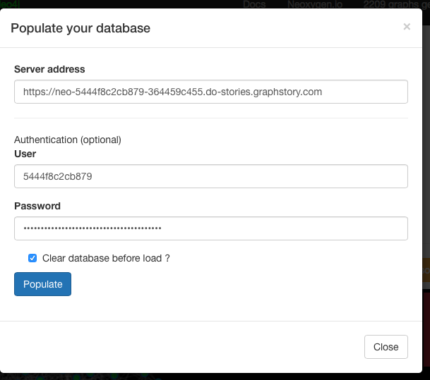
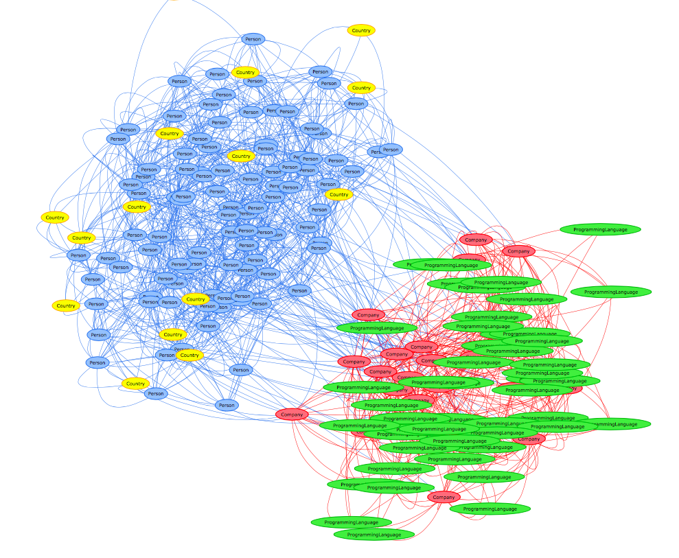
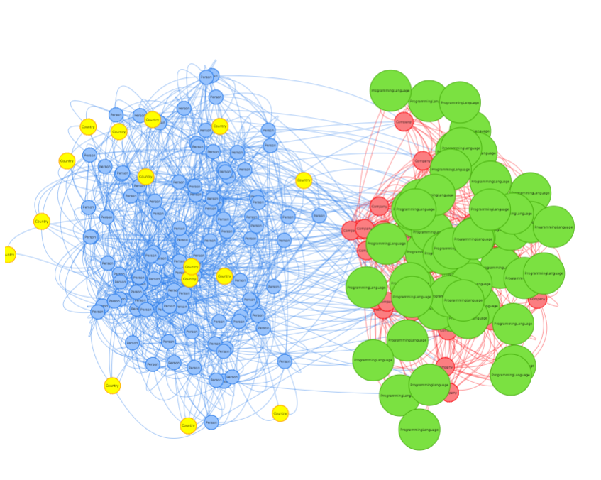
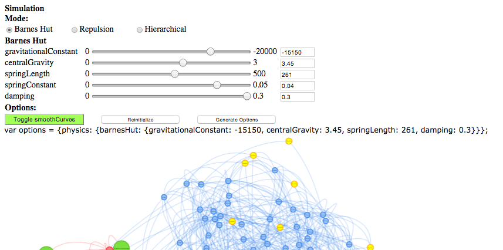
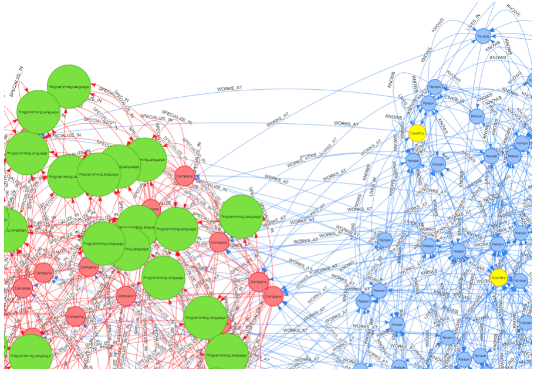

= Easy Graph Visualization with Vis.js
Christophe Willemsen <chris@neoxygen.io>
v1.0, 15-05-2015
:toc:
:homepage: http://chris.neoxygen.io
:keywords: neo4j, cypher, database, graph, visualization, javascript
:source-highlighter: highlightjs

== Introduction

Sometimes you just want to show data in an application. When working with graph databases like Neo4j, what more
natural than showing a graph visualisation.

There are plenty of javascript libraries available like Linkurious.js, sigma.js, vivagraph.js etc...

But for quick demos, configuration is sometimes painful when you just want a directed graph, with arrows on the edges,
nodes colors and maybe clustering.

I discovered recently link:http://visjs.org/[vis.js], a javascript library that makes things really easy.

We'll setup a quick demo with fake data to see how it works.

== Setup

I will use link:http://graphgen.neoxygen.io[Graphgen] to generate some data and import it into a Neo4j instance. If you do not have a local Neo4j instance
you can make use of awesome Neo4j as a service providers like link:https://www.graphstory.com/[GraphStory] or link:http://www.graphenedb.com/[GrapheneDB].

We will generate a graph representing persons living in a country, these persons works for a company
and these companies have a specialty in a programming language consultancy.

You can paste this Cypher representation into Graphgen and click on generate :

[source,cypher]
----
(person:#Person:#User *100)-[:LIVES_IN *n..1]->(country:Country {name:country} *15)
(person)-[:KNOWS *n..n]->(person)
(person)-[:WORKS_AT *n..1]->(company:Company {name:company} *25)
(company)-[:SPECIALIZE_IN *n..n]->(language:ProgrammingLanguage {name:progLanguage} *50)
----

You can then click on "Populate", enter the details of your Neo4j instance location and import the graph into
 your Neo4j database :

If you open your database browser you can see that the data is relevant to our use case.

Ok, but we can't embed the Neo4j browser in our application.

So let's use vis.js

== Using Vis.js

I'll create a simple `index.html` file including jquery and vis.js.

For installing jquery and vis, I used bower and the `bower install --save vis` and `bower install --save jquery` commands.

We have created a graph with Graphgen but for the sake of this blog post I exported the graph as json on
a github gist and we will be able to load it with Jquery's getJson function

[source,html]
<!doctype html>
<html lang="en">
<head>
    <meta charset="utf-8">
    <title>Vis.js demo</title>
    <link rel="stylesheet" href="bower_components/vis/dist/vis.min.css"/>
</head>
<body>

</body>
</html>

Here I just included the vis.js dependencies in my html file, I sent a Cypher query for getting the whole graph and
with NeoClient I mapped the nodes and relationships to a Javascript GraphJSON like format.

The *graph* html div container is the graph holder.

As you can see in the last lines, setting up vis.js is really easy and by defining the first label as a group in
the json data, the nodes are automatically colored differently.

=== Graph Styling

There are some issues however :

1. The nodes are elliptical, we want circles, no problem, a simple configuration and we can do it together with changing
the font-size.

[source,javascript]
----
var options = {
        nodes: {
            shape: 'circle',
            radius: 15,
            radiusMax: 20,
            fontSize: 11
        }
    };
    var network = new vis.Network(container, g, options);
----

=== Physics

So far so good, the directed graph is still moving due to the Physics. Configuring Physics is not easy and require some
understanding of visualisation internals, which I don't have.

Vis.js has a really handful `configurePhysics` option that will show up multiple configuration sliders and once
you're happy with the configuration you want, you can export this configuration in a json format.

Let's activate this configuration option :

[source,javascript]
----
var options = {
        configurePhysics: true,
        nodes: {
            shape: 'circle',
            radius: 15,
            radiusMax: 20,
            fontSize: 11
        }
    };
----

Once done, you can just copy the physics json configuration that appeared in the browser and paste it in your configuration options :

[source,cypher]
----
var options = {
        physics: {barnesHut: {gravitationalConstant: -15150, centralGravity: 3.45, springLength: 261, damping: 0.3}},
        nodes: {
            shape: 'circle',
            radius: 15,
            radiusMax: 20,
            fontSize: 11
        }
    };
----

=== Edges labels

Did you ever see what you need to code in a library like D3.js in order to have arrows on the edges and the edges
labels aligned on the edges ? A lot of code... :(

In Vis.js, it can not be more easier :

[source,javascript]
----
var options = {
        //...
        edges: {
            style: 'arrow',
            labelAlignment: 'line-above'
        }
    };
----

And that's it !

== Conclusion

Vis.js is a simple but powerful graph visualisation library, I feel like it is made for backend developers :)

I invite you to discover more about it, view the awesome demos and use cases and why not integrate it in your next project.

The demo with the Physics configuration is available here : http://chris.neoxygen.io/demos/

Have a nice weekend !
