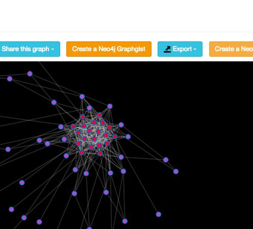
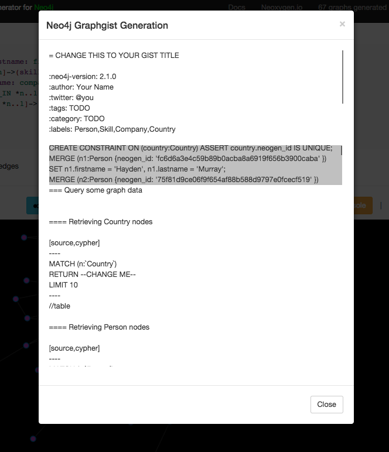

= Generate a graphgist of your graph on Graphgen
Christophe Willemsen <chris@neoxygen.io>
v1.0, 21-01-2015
:toc:
:homepage: http://chris.neoxygen.io
:keywords: neo4j, cypher, database, graph, console, graphgen, modelling, graphgist

== The Winter Graphgist Challenge

link:http://neo4j.com[Neo4j] announced yesterday the link:http://neo4j.com/blog/graphgist-winter-challenge/[Graphgist Winter Challenge].

This is a good opportunity for everyone to show their graph modeling and cypher skills or an intuitive way for discovering graph
databases.
link:http://graphgist.neo4j.com/[Graphgists] are also amazing resources for Graph modeling and use-case examples.

== Bonus for those using Graphgen

Graphgist document generation was initially planned for the upcoming update of Graphgen. The challenge annoucement was a good opportunity
to release in advance this feature and ease the participation for newcomers.

So here it is !

Heads up to link:http://graphgen.neoxygen.io[Graphgen] and start building your graph.

Once generated you will see a new action button **Create Graphgist**

Click on it and the setup of your graphgist document is done and all you need to do is to copy and paste it to a
adoc file and make it available on a public URL (dropbox, github-gist).

== What's included ?

* The setup of your graph
* Some `node matching` queries based on labels
* Some `node matching` queries based on node properties
* Some `node and his relationships matching` queries based on relationship types
* And some more nice queries

What is cool, is that without effort you can have a quick graphgist setup. So you have time to concentrate on modeling and describing it. And especially invest work in really good use-case queries for that domain :

I hope you will enjoy it and don't hesitate to ping me on Twitter for remarks, bugs or just saying me cheers !

I wish you an awesome weekend and good luck for the Graphgist Challenge.

Chris

