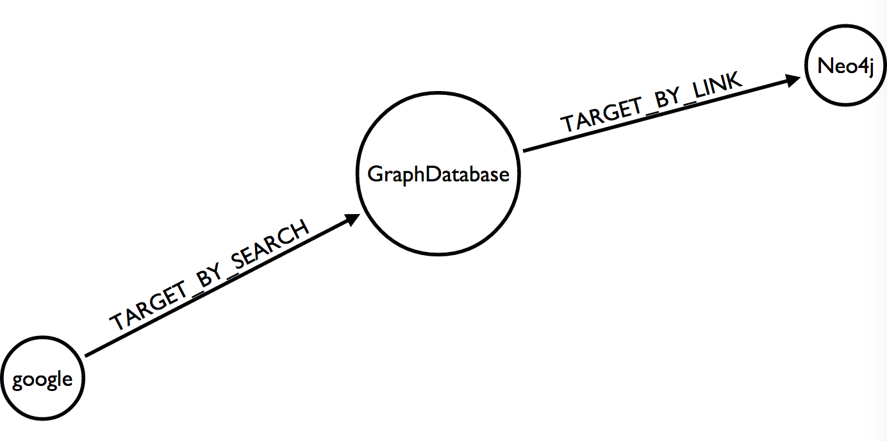

= Neo4j 2.2 and matching paths on dense nodes
Christophe Willemsen <chris@neoxygen.io>
v1.0, 17-03-2015
:toc:
:homepage: http://chris.neoxygen.io
:keywords: neo4j, cypher, database, graph, nodes, relationships, wikipedia, google, search

== TLDR;

During the last weekend, I came accross a tweet announcing that Wikimedia released the dataset ot the pages clickstreams
for February 2015.

++++
<blockquote class="twitter-tweet" lang="en">
La <a href="https://twitter.com/Wikimedia">@Wikimedia</a> Foundation libère en <a href="https://twitter.com/hashtag/OpenData?src=hash">#OpenData</a> des jeux de données sur l&#39;usage de Wikipedia (CC0) <a href="https://t.co/nTKlxRBIQG">https://t.co/nTKlxRBIQG</a>
&mdash; S.I.Lex (@Calimaq) <a href="https://twitter.com/Calimaq/status/577033473883439105">15 Mars 2015</a></blockquote>

++++

Not that I had nothing to do but I found it interesting to download this dataset and see how people arrive on the Neo4j's Wikipedia
page.

The data is quite simple, you have pages entities that relates to other pages. Pages can be or a Wikipedia page or representing
a non Wikipedia page like Google. Relationships can be or a user click from on wikipedia page to another or a user using a search
box like Google search or the Wikipedia search feature. The number of types the event occurs is also part of the dataset.

== Importing the dataset

You can download the dataset here : http://datahub.io/dataset/wikipedia-clickstream/resource/be85cc68-d1e6-4134-804a-fd36b94dbb82

Importing the dataset is really straightforward and the code I used can be found on
link:https://gist.github.com/ikwattro/acf99e7354bbb14b9c4f[this gist].

== Analysing the data

We can start with simple queries like the pages from where people are clicking before landing on the Neo4j page :

[source,cypher]
----
MATCH (neo:Page {title:'Neo4j'})
MATCH (neo)<-[r:TARGET_BY_LINK]-(from)
RETURN from.title, r.occurences

NoSQL	282
FlockDB	19
Paxos_(computer_science)	22
Cypher_Query_Language	19
Graph_database	814
List_of_AGPL_web_applications	11
Spatial_database	25
----

Or maybe in the second degree :

[source,cypher]
----
MATCH (neo:Page {title:'Neo4j'})
MATCH p=(neo)<-[:TARGET_BY_LINK*2..2]-(from)
WHERE neo <> from
RETURN extract(n in nodes(p) | n.title) as pages,
reduce(x=0, r in rels(p) | x + r.occurences) as occ
ORDER BY occ DESC
LIMIT 10

Neo4j, Graph_database, NoSQL	1450
Neo4j, Graph_database, Big_data	1045
Neo4j, Graph_database, Graph_(abstract_data_type)	967
Neo4j, Graph_database, Triplestore	897
Neo4j, Graph_database, Network_model	882
Neo4j, Graph_database, Nested_set_model	865
Neo4j, Graph_database, Graph_theory	863
Neo4j, Graph_database, DEX_(Graph_database)	856
Neo4j, Graph_database, Graph_(mathematics)	856
Neo4j, Graph_database, Cypher_Query_Language	852
----

So the NoSQL movement and the Graph ecosystem are the most common referers, which is not suprising.

== From Google to Neo4j

The last insight I wanted to gain is to know how people arrive at the Neo4j page from another one that they found via a google search.

The query seemed obvious to me and I expected really fast response times as I'm describing the whole pattern and the page
titles are indexed :

[source,cypher]
MATCH (neo:Page {title:'Neo4j'}), (google:Page {title:'other-google'})
MATCH (neo)<-[:TARGET_BY_LINK]-(x)<-[:TARGET_BY_SEARCH]-(google)
RETURN x.title

Unfortunately, this query took 24 seconds to return on my machine with a default 4GB heap settings for Neo4j.

NB: Note that the **other-google** Page node has more than 2 millions _TARGET_BY_SEARCH_ outgoing relationships.

My first reaction of course was to analyse the execution plan with PROFILE :

So why so much time and database accesses ? I was really enjoying the 2.2 release however
I was confused why the cost based planner couldn't figure out to run this simple query efficiently.

I tried different ways of doing the same query. Variable length paths, multiple relationships types etc... without any performance
improvement.

I spoke about this behavior with my friend http://twitter.com/mesirii[Michael] and he asked me to do change the query to the following.
He said that calculating matches on a simple pattern like `(x)<-[:TARGET_BY_SEARCH]-(google)` now takes the degree of both nodes at runtime into account
and checks from the side with the smaller degree. The same applies to calculating the counts of simple path expressions
like `size( (page)-[:TARGET_BY_LINK]->())` where also the degree of the given node is used instead of iterating the relationships.

[source,cypher]
----
MATCH (neo:Page {title:'Neo4j'}), (google:Page {title:'other-google'})
MATCH (neo)<-[:TARGET_BY_LINK]-(x)
WHERE (x)<-[:TARGET_BY_SEARCH]-(google)
RETURN count(*);

neo4j-sh (?)$ PROFILE MATCH (neo:Page {title:'Neo4j'}), (google:Page {title:'other-google'})
> MATCH (neo)<-[:TARGET_BY_LINK]-(x)
> WHERE (x)<-[:TARGET_BY_SEARCH]-(google)
> RETURN count(*);
+----------+
| count(*) |
+----------+
| 5        |
+----------+
1 row
210 ms

Compiler CYPHER 2.2

Planner COST

EagerAggregation
  |
  +SemiApply
    |
    +CartesianProduct
    |  |
    |  +NodeIndexSeek(0)
    |  |
    |  +Expand(All)
    |     |
    |     +NodeIndexSeek(1)
    |
    +Expand(Into)
       |
       +Argument

+------------------+---------------+------+--------+----------------+-----------------------------------+
|         Operator | EstimatedRows | Rows | DbHits |    Identifiers |                             Other |
+------------------+---------------+------+--------+----------------+-----------------------------------+
| EagerAggregation |           1.6 |    1 |      0 |       count(*) |                                   |
|        SemiApply |           2.7 |    5 |      0 | google, neo, x |                                   |
| CartesianProduct |           3.6 |    7 |      0 | google, neo, x |                                   |
| NodeIndexSeek(0) |           1.0 |    1 |      2 |         google |                      :Page(title) |
|      Expand(All) |           3.6 |    7 |      8 |         neo, x |      (neo)<-[:TARGET_BY_LINK]-(x) |
| NodeIndexSeek(1) |           1.0 |    1 |      2 |            neo |                      :Page(title) |
|     Expand(Into) |     0.0000025 |    0 |     43 |      google, x | (google)-[:TARGET_BY_SEARCH]->(x) |
|         Argument |           3.6 |    7 |      0 |      google, x |                                   |
+------------------+---------------+------+--------+----------------+-----------------------------------+

Total database accesses: 55
----

Wow, stunning, amazing, query returning results in 14ms as I expected in my first attempts. It looks like Cypher needs more hints
than in the previous 2.1.x versions.

You can still use the previous Cypher rule planner by prepending `PLANNER RULE` to your queries :

[source,cypher]
----
neo4j-sh (?)$ PLANNER RULE
> PROFILE MATCH (neo:Page {title:'Neo4j'}), (google:Page {title:'other-google'})
> MATCH (neo)<-[:TARGET_BY_LINK]-(x)<-[:TARGET_BY_SEARCH]-(google)
> RETURN x.title;
+---------------------------------+
| x.title                         |
+---------------------------------+
| "FlockDB"                       |
| "Cypher_Query_Language"         |
| "Spatial_database"              |
| "List_of_AGPL_web_applications" |
| "Graph_database"                |
+---------------------------------+
5 rows
17680 ms

Compiler CYPHER 2.2

Planner RULE

ColumnFilter
  |
  +Extract
    |
    +SimplePatternMatcher
      |
      +SchemaIndex(0)
        |
        +SchemaIndex(1)

+----------------------+------+--------+-------------------------------------------+-------------------------------+
|             Operator | Rows | DbHits |                               Identifiers |                         Other |
+----------------------+------+--------+-------------------------------------------+-------------------------------+
|         ColumnFilter |    5 |      0 |                                           |          keep columns x.title |
|              Extract |    5 |     10 |                                           |                       x.title |
| SimplePatternMatcher |    5 |      0 | x,   UNNAMED82, google, neo,   UNNAMED105 |                               |
|       SchemaIndex(0) |    1 |      2 |                            google, google | {  AUTOSTRING1}; :Page(title) |
|       SchemaIndex(1) |    1 |      2 |                                  neo, neo | {  AUTOSTRING0}; :Page(title) |
+----------------------+------+--------+-------------------------------------------+-------------------------------+

Total database accesses: 14
21949 ms
----

However I couldn't accept it as a final solution. Mostly because such queries make summing the relationship properties not so
user-friendly anymore.

Thanks again to Michael, he asked Neo4j Cypher team and their answer was the following :

----
The cost based planner only knows from the database statistics that a `:Page` node has between 5 and 2.000.000 relationships.
So when planning the query it doesn't have any runtime information and does not prefer either side of the query. At planning time
there is no runtime information available, only counts for labels, relationships and property cardinalities and selectivities,
so it actually doesn't know if the assumption holds true later.
----

So, if the __other-google__ node would have between 5 and 50k nodes, the first query would behave as I expected.

The solution is to tell Cypher which node to start from with the `USING` clause.

[source,cypher]
----
MATCH (page:Page {title:'Neo4j'}), (google:Page {title:'other-google'})
USING INDEX page:Page(title)
MATCH (page)<-[:TARGET_BY_LINK]-(x)<-[:TARGET_BY_SEARCH]-(google)
RETURN count(*);

neo4j-sh (?)$ PROFILE MATCH (page:Page {title:'Neo4j'}), (google:Page {title:'other-google'})
> USING INDEX page:Page(title)
> MATCH (page)<-[:TARGET_BY_LINK]-(x)<-[:TARGET_BY_SEARCH]-(google)
> RETURN count(*);
+----------+
| count(*) |
+----------+
| 5        |
+----------+
1 row
12 ms

Compiler CYPHER 2.2

Planner COST

EagerAggregation
  |
  +Filter
    |
    +Expand(All)(0)
      |
      +Expand(All)(1)
        |
        +NodeIndexSeek

+------------------+---------------+------+--------+-----------------+--------------------------------------------------------------------------+
|         Operator | EstimatedRows | Rows | DbHits |     Identifiers |                                                                    Other |
+------------------+---------------+------+--------+-----------------+--------------------------------------------------------------------------+
| EagerAggregation |        0.0016 |    1 |      0 |        count(*) |                                                                          |
|           Filter |     0.0000025 |    5 |     99 | google, page, x | (hasLabel(google:Page) AND Property(google,title(1)) == {  AUTOSTRING1}) |
|   Expand(All)(0) |           6.8 |   33 |     40 | google, page, x |                                        (x)<-[:TARGET_BY_SEARCH]-(google) |
|   Expand(All)(1) |           3.6 |    7 |      8 |         page, x |                                            (page)<-[:TARGET_BY_LINK]-(x) |
|    NodeIndexSeek |           1.0 |    1 |      2 |            page |                                                             :Page(title) |
+------------------+---------------+------+--------+-----------------+--------------------------------------------------------------------------+

Total database accesses: 149
----

And the query is done in 10ms !!!

== Conclusion

As always, the PROFILER allows you to quickly identify performance problems of your queries.

Thanks to Michael and the Neo4j Cypher team for a fast support.
