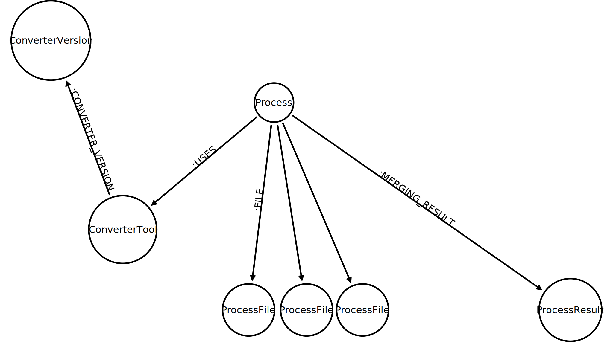
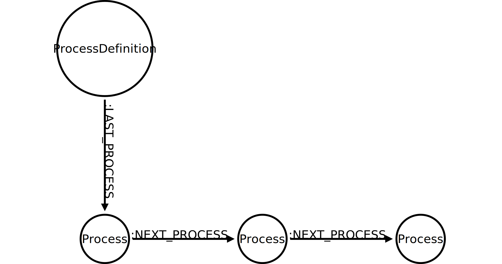
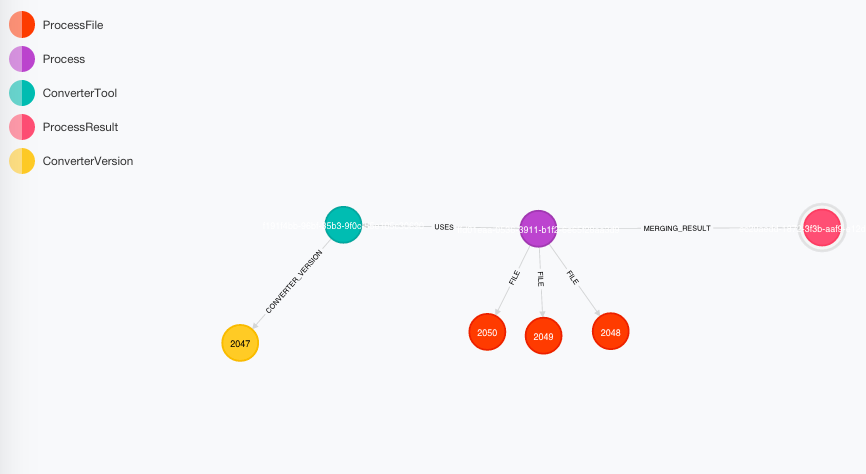

= Neo4j Belgian meetup on Graph Database Prototyping
Christophe Willemsen <chris@neoxygen.io>
v1.0, 21-01-2015
:toc:
:homepage: http://chris.neoxygen.io
:keywords: neo4j, cypher, database, graph, console, graphgen, modelling

== Introduction

On January 21st the Neo4j belgian meetup took place in the beautiful city of Antwerp. I'll pass through the common starting words
describing the venue and the atmosphere ( belgian beers are tasty and Rik is an awesome host, everybody knows it ! ).

This was one of the most interesting meetups I did !

Despite the various attendees levels, the choice of the Graph Database Prototyping topic was enjoying everybody.
The introduction slides were reduced to the minimum and a lot of questions were already raised about modeling designs.

Some common questions are :

* When to use nodes
* When to use properties
* Is having a node with 1000 relationships is a good idea
* Is it possible to have an index on relationship properties

These are also questions we see on forums like StackOverflow.

== Setting up the groups

After the introduction, people were settled up in three groups of 5 people, and could make the choice of one problem like to
solve with Neo4j and see how they can model it.

Rik, Kees and I were dispatched at the tables to provide explanation and modeling tips.

The fact that people were solving real problems they face everyday, you never loose their focus. They are concentrate, they
try to understand you and are less shy to ask more questions and going deeper.

Also the fact that they have to explain their problem or use-case, is a big effort for them, it is sometimes not easy to translate
to words something that is logical in your brain since a couple of years.

== The table workshop

The use-case faced by the people at my table was interesting and can show that starting from a simple description can
lead to the designing of a (big) data model.

This is a suite of file converting processes. Each process use a converter, that has a converter version.
The role of the converter is to merge multiple files in one and delivering a combined result.

If the end user see that the combined result has some failures, the process needs to be marked as failed, and the backend
administrator needs a way to identify which files were not merged correctly with which version of the converter.

We ended up with the following model :

Also, the processes would be themselves be modelled in a linked list, like a timeline :

You can generate a small test graph with link:http://graphgen.neoxygen.io[Graphgen] by entering the following pattern and click on generate :

[source,cypher]
----
(p:Process {id:uuid})-[:USES *n..1]->(ctool:ConverterTool {name:word, id:uuid})
(ctool)-[:CONVERTER_VERSION *n..1]->(cver:ConverterVersion {version:randomDigitNotNull})
(p)-[:FILE *1..n]->(file:ProcessFile {name:word} *3)
(p)-[:MERGING_RESULT *1..1]->(pr:ProcessResult {id:uuid})
----

Once the graph is generated and populated into your Neo4j database, you can open the browser and look for the desired Process node :

=== The merging result is incorrect

The first need they had is to be able to mark the process job as failed if the merging result is corrupted. You can do that in
multiple manners and we made the choice of using a **FailedProcess** label, doing it with Cypher is as you can see very easy :

[source,cypher]
----
MATCH (result:ProcessResult {id:"ec20aedd-1872-3f3b-aaf9-e12d4464a9c6"})<-[:MERGING_RESULT]-(process)
SET process :FailedProcess
----

=== Finding files affected by the failed result

[source,cypher]
----
MATCH (result:ProcessResult {id:"ec20aedd-1872-3f3b-aaf9-e12d4464a9c6"})<-[:MERGING_RESULT]-(process)
MATCH (process)-[:FILE]->(files)
RETURN files

files
name	officiis
name	itaque
name	inventore
Returned 3 rows in 59 ms
----

=== Finding the version of the converter used

[source,cypher]
----
MATCH (result:ProcessResult {id:"ec20aedd-1872-3f3b-aaf9-e12d4464a9c6"})<-[:MERGING_RESULT]-(process)
MATCH (process)-[:USES]->(converter)-[:CONVERTER_VERSION]->(version)
RETURN version

version
version	7
Returned 1 row in 64 ms
----

As you can see, this was not really difficult but people at the table were amazed at how the data looks natural in a graph
and how easy it is to query the graph with Cypher.

If you couldn't attend the meetup or want to discover more of the Neo4j Graph Database, I invite you to come to a local meetup
or to join us at FOSDEM'15 in Brussels on January 31st in the GraphDevRoom.

Thanks for reading,

